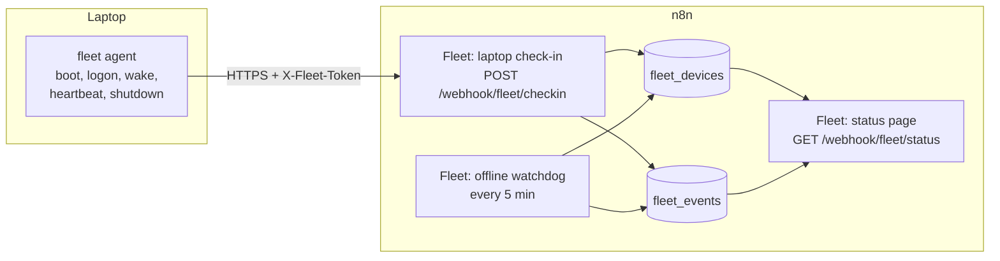

# Rental fleet laptop tracker

This folder contains a tracker for the laptops in a rental fleet. It records
when each laptop comes online, when it goes offline, and who is logged on.
It runs on n8n. It uses only built-in nodes and n8n data tables, so you do not
need an external database.

## How it works



1. An agent on each laptop sends a check-in on boot, user logon, wake from
   sleep, shutdown, and every 5 minutes.
2. The check-in workflow updates the laptop row in `fleet_devices`. When the
   check-in starts a new online session, the workflow adds an `online` event
   to `fleet_events`.
3. The watchdog workflow marks a laptop `offline` when it has not checked in
   for 15 minutes. It adds an `offline` event.
4. The status page shows all laptops and the last 100 events.

A check-in starts a new online session when one of these is true:

- The laptop has never checked in before.
- The laptop was offline.
- The last check-in is more than 15 minutes old.
- The event is `boot`.

Plain heartbeats update `lastSeenAt` only. They do not add events, so the
event table stays small.

## Data tables

`fleet_devices` has one row for each laptop:

| Column | Description |
|---|---|
| `deviceId` | BIOS serial number. The agent uses the OS machine ID if the serial is missing. |
| `hostname`, `serialNumber`, `os`, `osUser`, `localIp`, `publicIp`, `agentVersion` | Values from the last check-in. |
| `status` | `online` or `offline`. |
| `lastEvent` | Last agent event, or `timeout` when the watchdog set the laptop offline. |
| `lastOnlineAt` | Start of the current or last online session. |
| `lastSeenAt` | Time of the last check-in. |
| `lastOfflineAt` | Time of the last shutdown, or the last check-in before a timeout. |
| `lastBootAt` | Boot time that the laptop reported. |
| `firstSeenAt` | Time of the first check-in. |
| `onlineCount` | Number of online sessions. |
| `city`, `region`, `country`, `latitude`, `longitude` | Last known location. See "Location tracking" below. |
| `locationSource` | `ip` for the approximate location from the internet IP, or `gps` for a precise fix from the laptop. |
| `locationAccuracyM` | Fix accuracy in metres, for `gps` fixes only. |
| `locationAt` | Time of the last location. |
| `assetTag`, `rentedTo`, `notes` | Fill these by hand. The agents never change them. |

`fleet_events` has one row for each session change: `online`, `offline`,
`logon`, or `shutdown`. The `trigger` column tells which agent event caused
it. For `online` events, `offlineMinutes` tells how long the laptop was
offline before.

## Set up n8n

1. Import the four files in `workflows/` (**Workflows > Import from file**).
2. Open **Fleet: setup data tables** and run it once. It creates the two data
   tables.
3. Make a long random token, for example with `openssl rand -hex 32`. Use
   letters and digits only.
4. Create a **Header Auth** credential. Set the name to `X-Fleet-Token` and
   the value to the token. Select it on the **Check-in webhook** node of
   **Fleet: laptop check-in**.
5. Create a **Basic Auth** credential for the people who can see the status
   page. Select it on the **Status page** node of **Fleet: status page**.
6. Activate **Fleet: laptop check-in**, **Fleet: offline watchdog**, and
   **Fleet: status page**.
7. Optional: send test data with `tools/simulate.sh`, then open
   `https://<your-n8n>/webhook/fleet/status`.

To change the 15-minute offline limit, change `OFFLINE_AFTER_MINUTES` in the
Code nodes of all three workflows. Use the same value in each workflow.

To get an alert when a laptop comes online, add a Slack, email, or other node
after **Log event** in the check-in workflow. Put a filter before it on
`event` equal to `online`.

## Install the agent on the laptops

The agent needs the production webhook URL:
`https://<your-n8n>/webhook/fleet/checkin`.

### Windows 10 and 11

Open PowerShell as administrator in `agent/windows`, then run:

```powershell
.\install.ps1 -Url https://<your-n8n>/webhook/fleet/checkin -Token <token>
```

The installer copies the agent to `C:\ProgramData\FleetTracker`. Only SYSTEM
and administrators can read this folder. The installer creates these scheduled
tasks in the `\FleetTracker\` task folder. All of them run as SYSTEM:

| Task | Trigger | Event |
|---|---|---|
| Boot | Computer start | `boot` |
| Logon | Any user logon | `logon` |
| Wake | Wake from sleep (Power-Troubleshooter, event ID 1) | `wake` |
| Shutdown | Shutdown or restart (User32, event ID 1074) | `shutdown` |
| Heartbeat | Every 5 minutes | `heartbeat` |

The agent log is `C:\ProgramData\FleetTracker\agent.log`. To remove the agent,
run `.\uninstall.ps1` as administrator.

For many laptops, deploy the `agent/windows` folder with your device
management tool (Intune, Group Policy, or an imaging script) and run
`install.ps1` as SYSTEM.

### Linux (systemd) and macOS

Run this command in `agent/unix`:

```sh
sudo FLEET_URL=https://<your-n8n>/webhook/fleet/checkin FLEET_TOKEN=<token> ./install.sh
```

On Linux, the installer adds systemd units for boot and shutdown, wake from
sleep, and a 5-minute heartbeat timer. Logs go to
`journalctl -u 'fleet-agent-*'`.

On macOS, the installer adds two launch daemons: one for boot, and one for the
5-minute heartbeat. The heartbeat also detects wake from sleep, because the
first heartbeat after a long gap starts a new session. Logs go to
`/var/log/fleet-agent.log`.

To remove the agent, run `sudo ./uninstall.sh`.

## Location tracking

The tracker records where each laptop is. It shows the location on the status
page with a link to a map.

### Before you turn it on: tell the renters

Tracking the location of a device that someone else holds is regulated in many
places. In several countries you must tell the person and, for precise
tracking, get their agreement. Do this before you deploy:

- State in the rental agreement that the laptop reports its status and
  location to you, and why.
- Keep a short notice on the laptop, for example on the desktop or in the
  welcome pack.
- Collect only what you need. The approximate location below is enough for
  most fleet management. Keep precise location for recovery of overdue or
  missing units.

You are responsible for following the laws that apply to you. This tool does
not give legal advice.

### Approximate location (on by default)

The check-in workflow turns each laptop's internet IP into an approximate
city, region, and country. It stores the values and shows them on the status
page. This needs no extra software on the laptop. It is city-level only, not a
street address.

The workflow calls the free service `https://ipwho.is`. To use a different
service, change the **Geo lookup** node in **Fleet: laptop check-in**. The
**Merge geo** node after it reads `success`, `city`, `region`, `country`,
`latitude`, and `longitude` from the reply, so map those fields if the new
service uses other names. The workflow looks up the IP only when it is new or
changed, to keep the number of calls low.

### Precise location (opt-in, Windows only)

When you turn it on, the Windows agent asks Windows for a precise location
(GPS if present, or Wi-Fi and network position). It sends this instead of the
IP-based location. It returns a fix only when **Location Services** are on for
the device and for desktop apps.

Turn it on at install time:

```powershell
.\install.ps1 -Url https://<your-n8n>/webhook/fleet/checkin -Token <token> -Location
```

The agent never sends a precise location on shutdown, and it degrades to the
IP-based location when Windows returns no fix.

The Linux and macOS agents send the IP-based location only. Most rental
laptops of those types have no location hardware.

## Limits

- A laptop that loses power or network cannot send a shutdown event. The
  watchdog marks it offline after 15 minutes.
- For `offline` events, `occurredAt` is the time of the last check-in. The
  real time can be up to 5 minutes later.
- `publicIp` comes from the `X-Forwarded-For` header. It is empty when no
  reverse proxy is in front of n8n.
- The approximate location from the internet IP is city-level and can be
  wrong, for example on mobile networks or VPNs. Use precise location when
  you need a reliable position.
- Times are in UTC. The status page shows relative times, for example
  `5 min ago`. Hover over a time to see the exact value.
